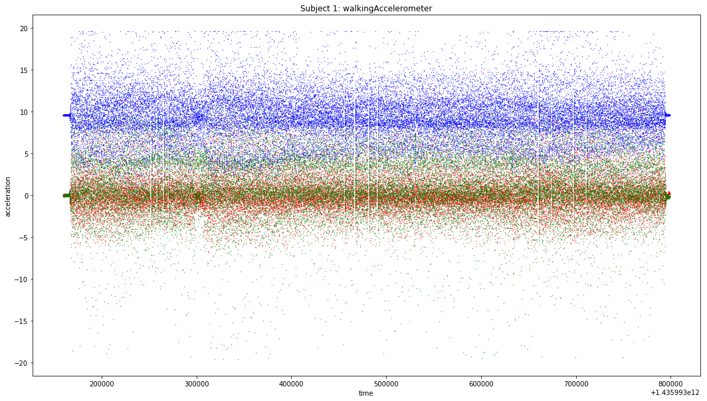
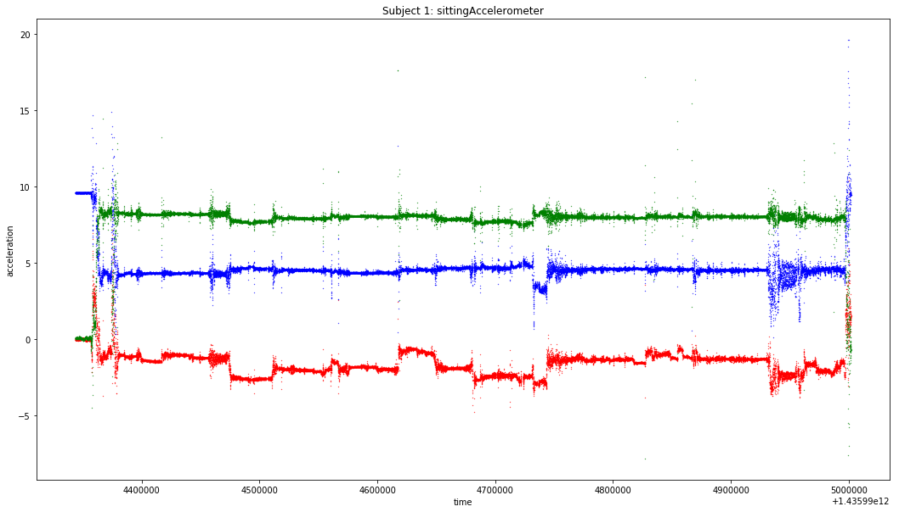
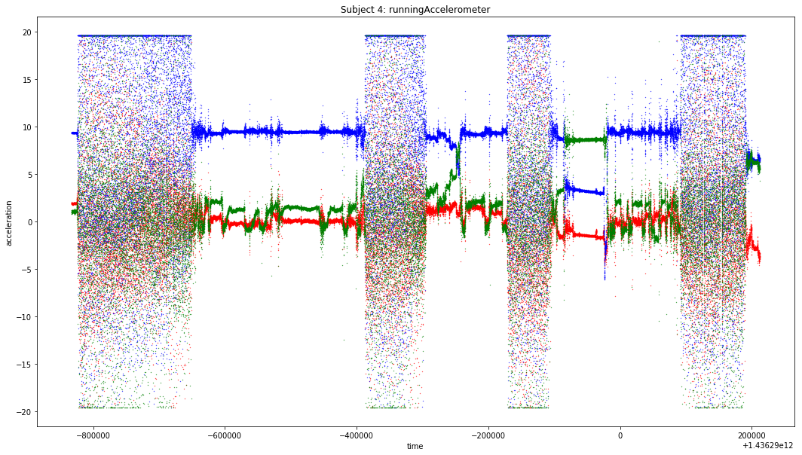
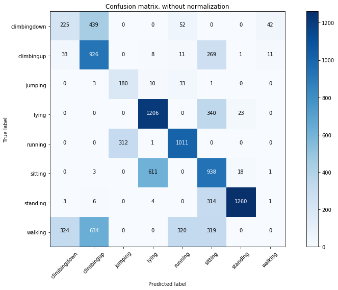

# Using Smartphones to Encourage Movement

## Sitting: One of the Most Dangerous Daily Activities

Physical inactivity and sedentary behavior has become a major public health risk around the world. Experts tell us that a minimum amount of daily physical activity is necessary to maintain health and reduce the risk of chronic diseases such as diabetes, heart disease, and cancer. Some researchers have suggested that sitting for long periods of time may in itself contribute to the problem, in addition to the total amount of inactivity. A [study published in 2017](https://mfprac.com/web2018/07literature/literature/Misc/SedentaryMortality_Diaz.pdf) found that sitting in periods of longer than 30 minutes at a time increased mortality risk after control for other factors. The total amount of sedentary time was separately a risk factor. A [follow-up study](https://academic.oup.com/aje/article-abstract/188/3/537/5245876) by the same team, published in January 2019, found that there was no benefit of reducing the duration of episodes of sitting unless those episodes were replaced with physical activity (of any intensity). 

## A Multi-Sensor in Everyone's Pocket

WIth the proliferation of screens of all sizes for both work and entertainment, many people find themselves sitting for much of the day. However, the same devices can also be useful for reminding people to be active. Smartphones contain numerous sensors that can be used to classify movement, particularly the following: accelerometer, gyroscope, and magnetometer. (GPS is also used for detecting movement, but is ineffective indoors.)
Continuously polling of smartphone sensors uses a lot of power and would drain phone batteries quickly. Therefore, a useful algorithm should be able to classify activities based on relatively infrequent polling of sensors.

## A Problem of Human Activity Recognition
There is an extensive literature on using sensors from smartphones and wearable devices to detect and classify different types of human activities. The most-used [UCI-HAR dataset](https://archive.ics.uci.edu/ml/datasets/human+activity+recognition+using+smartphones), published on UCI's machine learning repository, has accelerometer observations from 30 subjects labeled as WALKING, WALKING_UPSTAIRS, WALKING_DOWNSTAIRS, SITTING, STANDING, LAYING.

For promotion of physical activity, the most basic distinction necesssary is between activity and inactivity. It may also be useful to distinguish between sitting and standing (although the health benefits of standing compared to sitting are not clear). It also is important to distinguish by the intensity of the activity, such as walking compared to running.

The goal of this project is to develop a model using sensor data from ordinary smartphones that can distinguish between a) active and inactive states b) walking and running (or other more intense activity) and c) sitting and standing.

## The Real World Dataset
There are several other publicly available datasets of human activity data that can be used for model development. I chose to use the [Real World Dataset](https://sensor.informatik.uni-mannheim.de/#dataset_realworld) created by the University of Mannheim - Research Group Data and Web Science. This dataset includes two more active activities (running and jumping), in addition to the same six activities in the UCI-HAR dataset. In total the 8 activity classes are: climbing down stairs, climbing up stairs, jumping, lying, standing, sitting, running/jogging, and walking. The researchers outfitted 15 subjects with smartphones or smartwatches in 7 body positions: chest, forearm, head, shin, thigh, upper arm, and waist. I decided to use only the data from the "thigh" position under the assumption that it most resembles the pocket position. The dataset includes data from the following sensors: acceleration, GPS, gyroscope, light, magnetic field, and sound level. This analysis includes the triaxial data from the accelerometer and gyroscope. The subjects were asked to perform each activity for 10 minutes (except 2 minutes for jumping). The sensors were recorded at 50 Hz (50 observations per second).

## Exploratory Data Analysis

I created triaxial scatterplots of the accelerometer and gyroscope data for each of the 15 subjects performing each of the 8 activities. For example, a typical plot of walking accelerometer data is as follows:

A plot of the same subject sitting looks very different:

As can be seen from these plots, the subjects were asked to wait a short time before beginning the assigned activity. Thus the labels for the beginning and end of each activity period are typically incorrect. In addition, it is clear from inspecting the plots that not all subjects performed the assigned activity continuously. For example, Subject 4 stood for several periods in between bouts of running, as can be seen from the following plot:

## Correcting the Labels
Because the subjects did not perform the assigned activities continuously for the entire period, it was necessary to filter the data to remove periods that would be otherwise mislabeled. The modeling approach was based on dividing the raw data into 2-second windows (100 observations at 50 Hz). I labeled each 100 consecutive observations in each subject/activity with a sample number (dropping any remainder). I then calculated the standard deviation of the sensor data for each of the samples. I then plotted the standard deviations. For example, the following is a plot of the standard deviations of the accelerometer data for Subject 4, running:

The times when the subject was not running can clearly be seen. By inspecting this and similar plots for all the subjects, a threshold of 5 for the s.d. of the y accelerometer reading was picked as a cutoff. All samples with a s.d. less than 5 were deleted from the data. Similarly, thresholds were established for all the other activities--maxima for stationary activities (sitting, lying) and minima for moving activities. No filtering was done for standing, since it seemed that the subjects did not transition to or from standing during the recording periods.

## Separating Data into Train and Test Sets
Data from the first 10 subjects was used to develop the model. Data from the remaining 5 subjects was used to validate the model. In order to develop a generalizable model, the modeling data was further divided into train and test samples. I tried two methods: random selection of samples using the "validation split" setting in Keras and manually dividing the sample into a training group of subjects 1 to 7 and a test group of subjects 8 to 10. 

## Recurrent Neural Network
The basic model was a recurrent neural network using GRU or LSTM. I tried a single-layer GRU model with 32 neurons. I also tried a model with two LSTM layers of 128 neurons each. (I also tried several variations between these extremes.)

## Convolution Model
Adding one or more 1D convolution layers to the recurrent network generally improved the accuracy on the test data (reducing overfitting). For example, a model with two convolutional layers and two GRU layers achieved an accuracy of 68% on the test data, split by subject. A similar CNN-GRU model achieved an accuracy of 75%-80% on test data split randomly.

## Model Validation
One of the best-fitting models was pickled and then used to predict classes for the 5-subject validation set. The overall accuracy of the predictions was 0.58, and the weighted average F1 score was 0.54. A confusion matrix by class is shown below:

Although the overall accuracy of the model is low, it is able to distinguish between active and inactive states. Standing was almost always correctly classified. Lying was almost always correctly classified or incorrectly classified as sitting. When sitting was misclassified it was typically predicting standing or lying, but there were too many cases where it was labeled as walking or climbing up stairs

## Further Improvements
This model needs to be improved before it can be a useful tool. I plan to improve the model by scaling the data by subject to account for differences between individuals (e.g., in height). I also will see if adding the magnetometer data improves the model accuracy.
